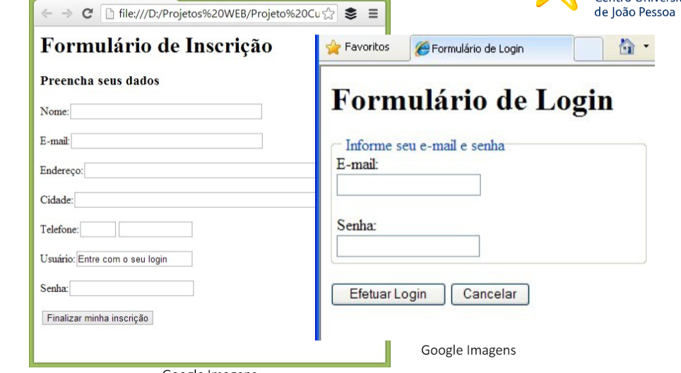

<h1 align="center">Exercicio clone de login 📓</h1>

 

Exercicio com o objetivo de fazer um clone da pagina mostrada na aula 5 do dia 12/03

 

## 💻 Version 1.0

 

  

    
  

 

## License

This project is licensed under the [MIT License](https://opensource.org/license/mit/). Feel free to use, modify and distribute it as needed.

 
 
 
<h4 align="center"> 
	🚧  Exercicio clone de login 📓 FINISHED  🚧
</h4>
 
 
 
 
 

Made with ❤️ by Marcus Vinicius 👋🏽 Get in touch!

//done readme marcus

### 𝐇𝐞𝐥𝐥𝐨 𝐭𝐡𝐞𝐫𝐞, 𝐟𝐞𝐥𝐥𝐨𝐰 <𝚌𝚘𝚍𝚎𝚛𝚜/>! 

I'm a Web Developer, a programmer looking to make   a difference in the digital world. [**Personal Site**](https://marcus-dev.vercel.app/) 🚀

#### My current tools

📲 Front-end Mobile with React Native  
💻 Front-end Web with Reactjs  
📡 Back-end with Nodejs  
🔣 Typescript  
🧰 And more...

#### 💬 Find me elsewhere

